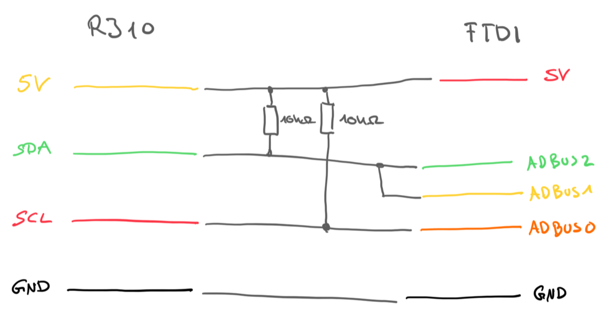
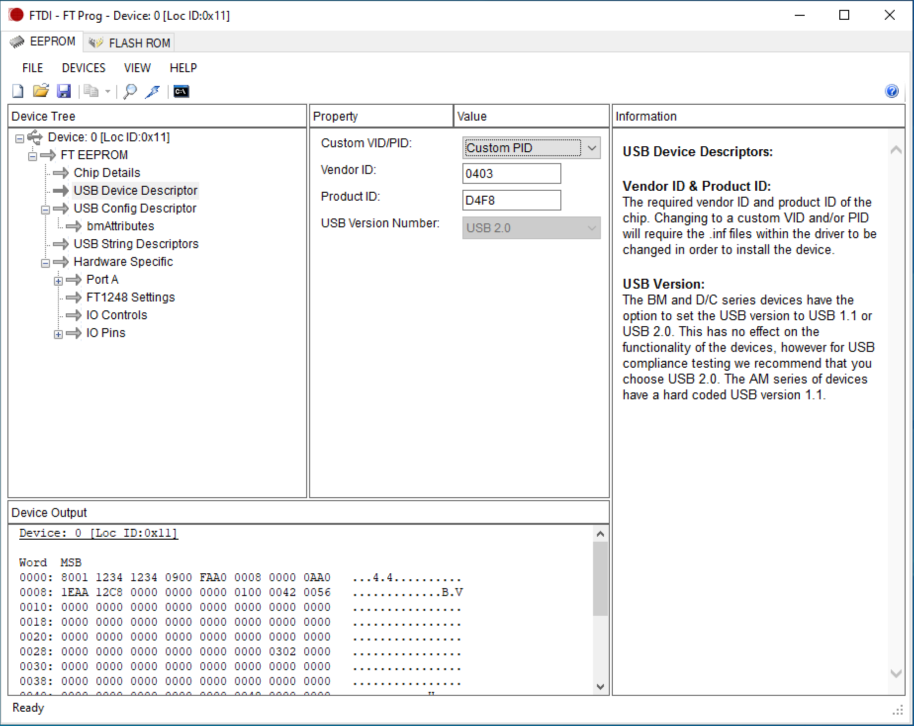

dbus-lynx-distributor
===

A Venus OS 'plugin' to read out Victron's [Lynx Distributor](https://www.victronenergy.de/dc-distribution-systems/lynx-distributor) without a [Lynx Smart BMS](https://www.victronenergy.de/battery-management-systems/lynx-smart-bms). It requires a custom adapter hardware (see below) and emulates a battery (without SoC, ...) on DBUS just providing the distributor information.

*Disclaimer*

This plugin comes without any guarantees or warranties. Use it at your own risk. I only tested it on my hardware setup.

## Hardware

### Background

The Lynx Distributor has a RJ10 connector for daisy-chaining distributors and connecting them to a Lynx Smart BMS. According to the [manual](https://www.victronenergy.com/upload/documents/Lynx_Distributor/24531-Lynx_Distributor_Manual-pdf-en.pdf), section 3.3 the PCB can be also used without data transfer by providing 5 V.

I reversed engineered the data communication on pins 2 and 3 of the connector and came to the following conclusions:

It's an [I²C](https://de.wikipedia.org/wiki/I²C) interface. The cable has the following mapping:

```
Pin 1 - yellow - 5V
Pin 2 - green - SDA
Pin 3 - red - SCL
Pin 4 - black - GND
```

A pull-up resistors (I used 10 kΩ) is required on SDA/SCL to 5V.

The device answers on I²C address `0b000001AA` where `AA` is set by the address jumper. So in default configuration the address is `0x8`.

Any reads on the device will always return the same status byte with the following meaning:

```
0b00000000 - Everything allright (center LED is green)
0b00000010 - No supply on bus bar (center LED is orange)
0b00010000 - Fuse 1 open (center LED red, first fuse LED red)
0b00100000 - Fuse 2 open (center LED red, second fuse LED red)
0b01000000 - Fuse 3 open (center LED red, third fuse LED red)
0b10000000 - Fuse 4 open (center LED red, forth fuse LED red)
```

If multiple fuses are open multiple bits are set (just or the values).

### Adapter

As [Cerbo GX](https://www.victronenergy.de/communication-centres/cerbo-gx) doesn't provide any I²C interfaces an adapter is needed. I choose the [C232HM-EDHSL-0](https://ftdichip.com/products/c232hm-edhsl-0/) from FTDI as it is 'premade' available. I personally used the 3.3V variant ([C232HM-DDHSL-0](https://ftdichip.com/products/c232hm-ddhsl-0/)) which provides less than the according to the manual required 5V, but it works on my device.

Any other FTDI adapter/board using a [FT232H](https://ftdichip.com/products/ft232hq/) chip should work. The bigger variants [FT2232H](https://ftdichip.com/products/ft2232hq/) and [FT4232H](https://ftdichip.com/products/ft4232hq/) won't work without adaptions in the software as they don't feature the open-drain option for the pins (see comment on page 4 of FTDI's [AN 255](https://www.ftdichip.com/Support/Documents/AppNotes/AN_255_USB%20to%20I2C%20Example%20using%20the%20FT232H%20and%20FT201X%20devices.pdf)). Be aware of counterfeit FTDI chips and buy from a trustworthy source!

The following connection's need to be made:



As Venus OS supports those FTDI's chip by default it would the Linux kernel's USB serial driver for them and scan the serial ports using `serial-starter`. To avoid this I changed the VID/PID of the FT232H chip using FTDI's [FT_PROG](https://ftdichip.com/utilities/).



The VID 0x0403 / PID 0xD4F8 I used is out of a PID block I got from FTDI in 2005. Feel free to re-use on your adapter/board as well. 

Besides the VID/PID I changed the Manufacturer to 'twam.info', the Product Description to 'I2C Master' , Port A's Hardware to 245 FIFO and Port A's Driver to D2XX Direct. All those should be optional.

## Software

To be able to use I²C with the FT232H chip its MPSSE mode must be used. There are plenty of options to use this mode (FTDI's official drivers, libftdi, pyftdi), but all of them required custom drivers, ... to be compiled/installed on Venus OS which are not premade available.

Therefore I re-implemented the the required drivers parts in Python just using `https://github.com/pyusb/pyusb` which is available on Venus OS via `pip`.

### Installation

Download into `/data/dbus-lynx-distributor` on your Venus device (e.g. Cerbo GX) and run `install.sh`

### Configuration

Rename `config.sample.ini` and change to needs.